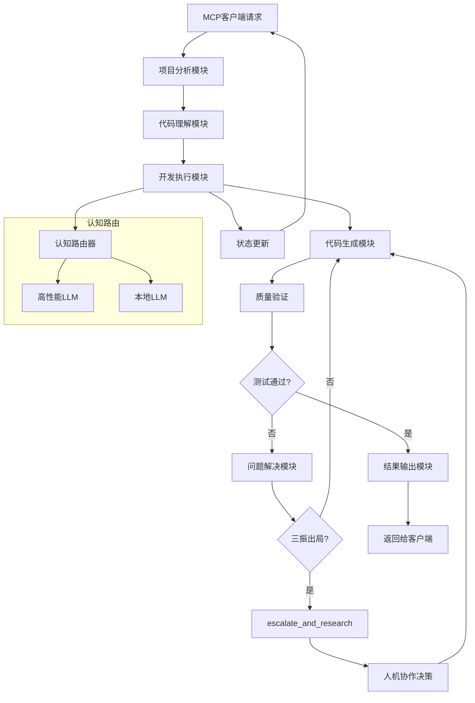

# MCP-DevAgent 产品需求文档

**版本**: v1.0.0  
**创建日期**: 2025年08月29日  
**最后更新**: 2025年08月29日  
**文档类型**: 产品需求文档 (PRD)  
**基准文档**: PRD.md  
**文档状态**: 已更新  

---

## 1. 产品概述

MCP-DevAgent 是一个基于模型上下文协议（MCP）构建的AI驱动开发代理服务，通过测试驱动开发(TDD)方法论和多代理协作架构，实现从产品需求到可部署代码的全自动化开发流程。作为纯MCP服务，该产品专注于提供标准化的AI开发能力，解决传统AI代码生成中的功能蔓延、技术栈不合规和代码质量不稳定等核心问题。

## 2. 核心特性

### 2.1 用户角色

| 角色 | 使用方式 | 核心权限 |
|------|----------|----------|
| MCP客户端 | 通过MCP协议调用服务 | 可发起开发任务、获取开发状态、接收代码输出 |
| 开发工程师 | 配置MCP服务参数 | 可设置技术约束、监控服务状态、调试代码问题 |
| 系统集成者 | 集成MCP服务到开发工具链 | 可配置服务接口、管理服务实例、监控性能指标 |

### 2.2 功能模块

本MCP服务包含以下核心功能模块：

1. **项目分析模块**: 需求解析、技术栈配置、开发参数设置
2. **代码理解模块**: RAG代码库索引、AST分析、上下文注入
3. **开发执行模块**: 多代理协作、认知路由、状态管理、思维链记录
4. **代码生成模块**: 测试用例生成、功能代码生成、质量验证
5. **问题解决模块**: 三振出局机制、升级研究、人机协作决策
6. **结果输出模块**: 代码交付、状态报告、错误诊断

### 2.3 模块详情

| 模块名称 | 子模块名称 | 功能描述 |
|----------|------------|----------|
| 项目分析模块 | 需求解析引擎 | 解析PRD文档、提取功能需求、识别技术约束 |
| 项目分析模块 | 技术栈配置器 | 验证技术栈兼容性、生成配置模板、管理依赖关系 |
| 项目分析模块 | 开发参数设置器 | 配置代码规范、设置测试覆盖率、定义质量标准 |
| 代码理解模块 | RAG索引引擎 | 构建代码库知识图谱、AST分析、符号依赖索引 |
| 代码理解模块 | 上下文注入器 | 检索相关代码片段、API定义、设计模式作为生成上下文 |
| 代码理解模块 | 一致性检查器 | 确保新代码与现有代码库的模式和约定保持一致 |
| 开发执行模块 | 多代理协调器 | 管理五个AI代理的协作、状态同步、任务调度 |
| 开发执行模块 | 认知路由器 | 根据任务复杂性智能选择LLM、成本优化、负载均衡 |
| 开发执行模块 | 状态管理器 | 维护开发状态、记录进度信息、处理状态转换 |
| 开发执行模块 | 思维链记录器 | 记录整套开发流程的AI决策过程，包括规划、测试生成、代码开发、验证等所有阶段，支持分支和修正、追踪问题解决路径 |
| 代码生成模块 | 测试用例生成器 | 基于TDD原则生成测试代码、覆盖边界情况、验证功能需求 |
| 代码生成模块 | 功能代码生成器 | 生成通过测试的功能代码、遵循技术栈约束、保证代码质量 |
| 代码生成模块 | 质量验证器 | 执行自动化测试、分析代码质量、检测安全漏洞 |
| 问题解决模块 | 失败计数器 | 跟踪修复尝试次数、触发升级条件、防止无效循环 |
| 问题解决模块 | escalate_and_research代理 | 执行深度问题分析、研究备选方案、生成决策报告 |
| 问题解决模块 | 人机协作接口 | 结构化问题呈现、请求人类决策、接收指导反馈 |
| 结果输出模块 | 代码交付器 | 组织生成的代码文件、创建项目结构、生成文档 |
| 结果输出模块 | 状态报告器 | 生成开发状态报告、提供进度信息、记录关键指标 |
| 结果输出模块 | 错误诊断器 | 分析失败原因、提供修复建议、生成调试信息 |

## 3. 核心流程

### 主要服务调用流程

**MCP客户端调用流程**:
1. 建立MCP连接 → 发送开发请求 → 提供PRD文档和技术约束 → 接收状态更新 → 获取生成代码 → 验证交付结果

**开发工程师配置流程**:
1. 配置MCP服务参数 → 设置技术栈约束 → 定义代码规范 → 监控服务状态 → 查看思维链记录 → 调试问题代码 → 优化服务配置

**MCP服务自动化流程**:
1. 接收开发请求 → 需求分析 → 架构规划 → 模块分解 → 测试用例生成 → 功能代码生成 → 自动化测试 → 问题修复 → 质量验证 → 返回代码结果

### MCP服务流程图



## 4. MCP协议接口设计

### 4.1 MCP服务接口

- **协议版本**: MCP 1.0
- **传输协议**: JSON-RPC 2.0 over WebSocket/HTTP
- **认证方式**: API密钥认证
- **数据格式**: JSON结构化数据
- **错误处理**: 标准化错误码和错误消息
- **状态管理**: 基于会话的状态跟踪
- **并发控制**: 支持多客户端并发访问

### 4.2 核心接口定义

| 接口名称 | 接口类型 | 功能描述 |
|----------|----------|----------|
| project/analyze | MCP工具调用 | 接收PRD文档，返回项目分析结果和开发计划 |
| codebase/index | MCP工具调用 | 索引现有代码库，构建RAG知识图谱 |
| development/start | MCP工具调用 | 启动开发流程，返回任务ID和初始状态 |
| development/status | MCP资源查询 | 查询开发状态，返回当前进度和代理状态 |
| development/logs | MCP资源查询 | 获取思维链记录，支持分支和修正查询 |
| cognitive/route | MCP工具调用 | 智能路由任务到合适的LLM，优化成本和性能 |
| code/generate | MCP工具调用 | 生成代码模块，返回测试代码和功能代码 |
| code/validate | MCP工具调用 | 验证代码质量，返回测试结果和质量报告 |
| problem/escalate | MCP工具调用 | 触发三振出局升级，返回问题分析报告 |
| problem/research | MCP工具调用 | 执行深度问题研究，返回备选解决方案 |
| project/export | MCP工具调用 | 导出项目代码，返回完整的代码包 |

### 4.3 数据交换格式

MCP服务采用标准化的JSON数据格式，确保与各种MCP客户端的兼容性。所有接口都遵循MCP协议规范，支持工具调用、资源查询和状态通知等核心功能。

---

## 5. 技术要求与约束

### 5.1 核心技术栈
- **MCP协议**: MCP Python SDK 1.13.1 (最新稳定版本)
- **工作流引擎**: LangGraph 0.6.6
- **开发语言**: Python 3.11+
- **Web框架**: FastAPI 0.116.1 + Uvicorn 0.35.0
- **数据验证**: Pydantic 2.11.7
- **数据存储**: SQLite 3.45+ (思维链和状态管理)
- **测试框架**: Pytest 8.4.1 (Python生态主要测试框架)

### 5.2 数据模型概述

核心数据实体包括：
- **开发运行记录** (development_runs): 记录每次完整的开发会话，关联代码库索引
- **模块记录** (modules): 跟踪各个开发模块的状态、进度和失败计数
- **思维链记录** (cot_records): 存储整套开发流程的AI代理思考过程，包括规划、测试生成、代码开发、验证等所有阶段，支持分支和修正追踪
- **测试结果** (test_results): 记录所有测试执行的详细结果
- **代码库索引** (codebase_indexes): 管理项目代码库的RAG索引信息
- **代码构件** (code_artifacts): 存储代码文件的AST、符号和依赖关系
- **问题升级** (problem_escalations): 记录"三振出局"后的问题升级和解决方案

### 5.2 服务架构
- **AI模型接入**: 支持 OpenAI、Claude、本地模型的统一接口
- **代码存储**: 文件系统 + 版本控制
- **执行环境**: Docker 容器化沙箱
- **并发处理**: 异步任务队列和状态管理

### 5.3 质量标准
- **代码覆盖率**: 最低 80%
- **响应时间**: 页面加载 < 2秒，API响应 < 500ms
- **可用性**: 99.5% 系统可用性
- **安全性**: 代码沙箱执行，用户数据加密存储

---

## 6. 绝对规则与约束

### 6.1 开发流程约束
1. **严格TDD**: 必须先生成测试用例，再生成功能代码
2. **技术栈合规**: 生成代码必须符合预设技术栈约束
3. **模块原子化**: 每个模块必须功能单一、可独立测试
4. **思维链记录**: 整套开发流程的所有AI决策过程必须完整记录到数据库，包括规划、测试生成、代码开发、验证等各个阶段，支持分支和修正追踪
5. **代码一致性**: 新生成代码必须与现有代码库的模式和约定保持一致
6. **智能路由**: 必须根据任务复杂性选择合适的LLM，优化成本效益
7. **三振出局**: 同一问题最多尝试3次修复，超过后必须升级到人机协作

### 6.2 质量保证规则
1. **零容忍原则**: 不允许生成无法通过测试的代码
2. **安全第一**: 所有代码执行必须在沙箱环境中进行
3. **可追溯性**: 每行代码都必须能追溯到对应的需求和测试用例
4. **一致性检查**: 生成代码必须符合项目整体架构和规范
5. **上下文完整性**: 代码生成必须基于完整的代码库上下文和相关模式
6. **失败分析**: 每次修复失败都必须记录原因和尝试的解决方案
7. **升级透明**: 问题升级过程必须提供完整的分析报告和备选方案

### 6.3 用户体验原则
1. **透明化**: 用户可以实时查看开发进度和AI决策过程
2. **可控性**: 用户可以在任何阶段暂停、修改或重启开发流程
3. **可理解性**: 所有技术概念都必须有清晰的用户友好解释
4. **可靠性**: 系统必须能够优雅处理各种异常情况

---

## 7. 项目结构说明

### 7.1 核心目录结构
```
├── src/                    # 源代码目录
│   └── mcp_devagent/      # 主要应用代码
├── tests/                 # 测试文件目录
│   ├── integration/       # 集成测试
│   └── docs/             # 测试文档
├── migrations/           # 数据库迁移脚本
├── scripts/              # 实用工具脚本
├── data/                 # 数据存储目录
├── docs/                 # 项目文档
└── .trae/               # Trae IDE配置
```

### 7.2 未来路线图

#### 短期目标 (3个月)
- 完成核心TDD工作流实现
- 实现基础的思维链可视化和查询
- 优化MCP协议的性能和稳定性
- 发布MVP版本

#### 中期目标 (6个月)
- 高级交互式调试：赋予AI分析运行时日志、设置断点（模拟）、并进行交互式调试的能力
- 自动化文档生成：在代码开发完成后，自动生成或更新API文档、代码注释和项目的README文件
- 增强代码质量分析和重构建议
- 实现团队协作和多项目管理功能

#### 长期愿景 (12个月)
- 基础设施即代码 (IaC) 生成：能够根据项目特性，自动生成Dockerfile、docker-compose.yml或CI/CD流水线配置文件
- 支持微服务架构的复杂项目开发
- 实现跨项目的代码复用和模板管理
- 集成代码审查和安全扫描能力
- 构建MCP服务生态和扩展插件市场

---

**文档状态**: 已完成  
**最后更新**: 2025年08月29日  
**审核状态**: 待审核