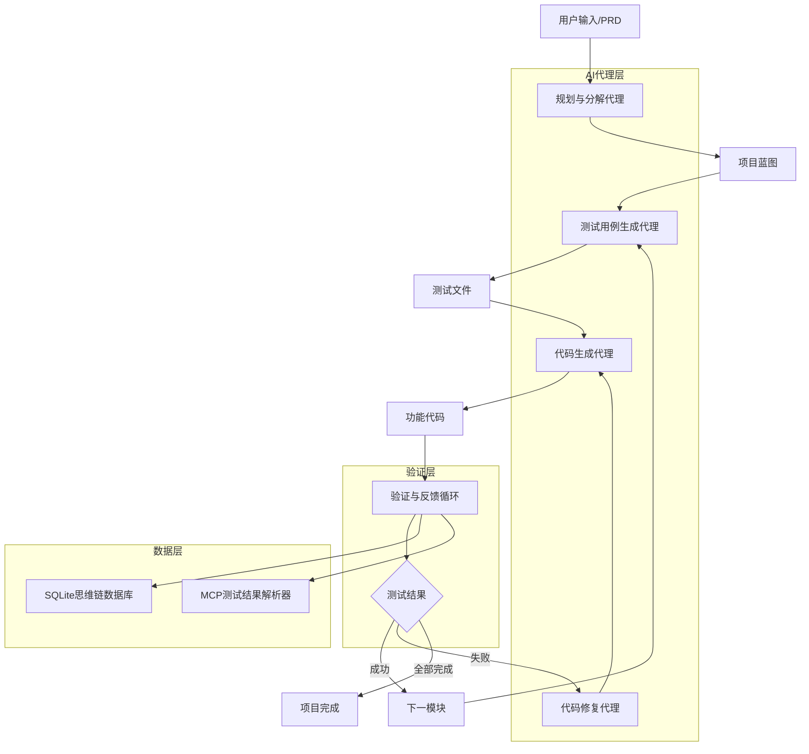
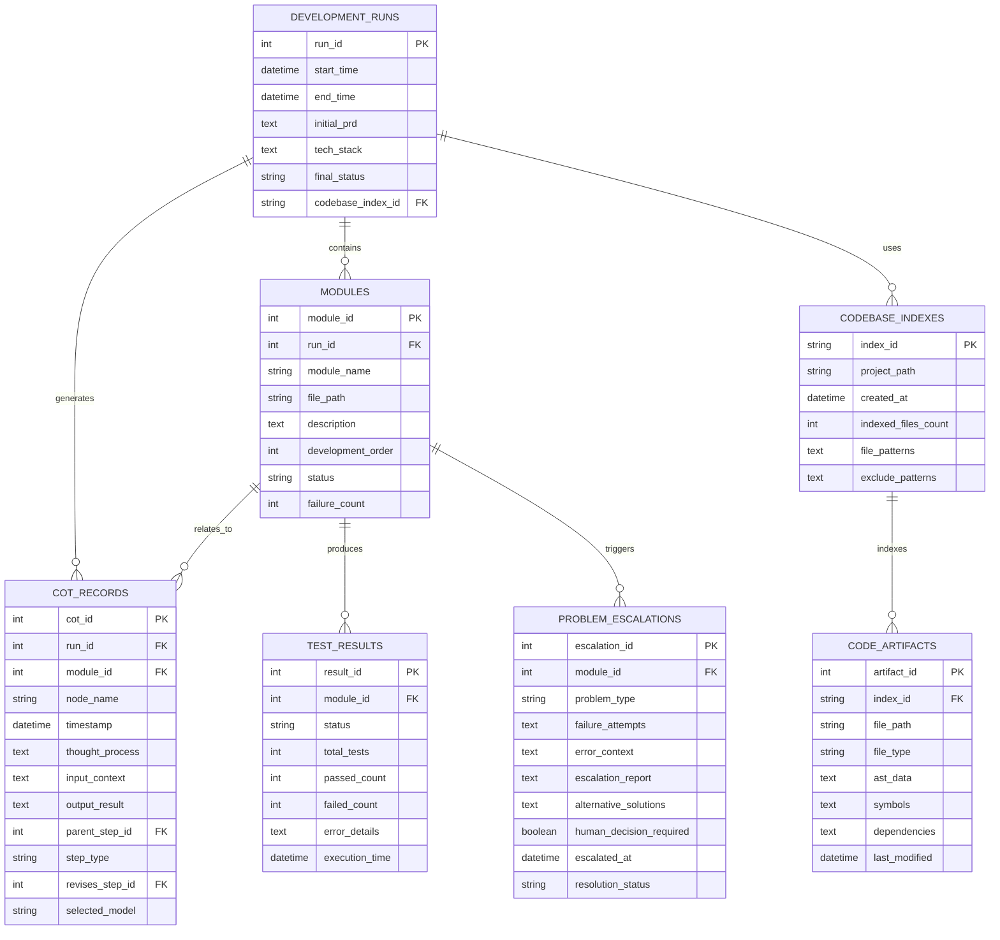

# MCP-DevAgent 技术架构文档

**文档版本**: v1.0.0  
**创建日期**: 2025年08月29日  
**最后更新**: 2025年08月29日  
**文档类型**: 技术架构设计  
**基准文档**: PRD.md, chat.md  
**文档状态**: 已完成  

---

## 1. 架构设计



## 2. 核心技术栈

### 2.1 主要技术组件

| 技术组件 | 版本 | 用途 | 选择原因 |
|---------|------|------|----------|
| **LangGraph** | 0.6.6 | AI工作流引擎 | 提供结构化的AI代理编排能力，支持复杂的多步骤推理流程 |
| **Python** | 3.11+ | 核心开发语言 | 丰富的AI生态系统，与LangGraph完美集成 |
| **SQLite** | 3.45+ | 本地数据存储 | 轻量级、无服务器、支持复杂查询的嵌入式数据库 |
| **LangChain** | 0.3.27 | LLM框架核心 | 统一LLM接口抽象，支持多种模型提供商 |
| **LangChain-Community** | 0.3.29 | 社区集成包 | 丰富的第三方LLM和工具集成 |
| **LangChain-OpenAI** | 0.3.32 | OpenAI集成 | GPT模型和嵌入服务的官方集成 |
| **LangChain-Anthropic** | 0.3.19 | Anthropic集成 | Claude模型的官方集成支持 |
| **LangChain-Ollama** | 0.3.7 | Ollama集成 | 本地模型部署和嵌入生成支持 |
| **MCP Python SDK** | 1.13.1 | MCP协议实现 | 最新版本的MCP Python SDK，提供标准化的MCP服务器和客户端实现 |
| **FastAPI** | 0.116.1 | Web框架 | 高性能异步Web框架，用于构建API服务 |
| **Uvicorn** | 0.35.0 | ASGI服务器 | 高性能ASGI服务器，支持异步Web应用 |
| **Pydantic** | 2.11.7 | 数据验证 | 强类型数据验证和序列化库 |
| **Pytest** | 8.4.1 | 测试框架 | Python生态系统中最流行的测试框架 |

### 2.2 架构层次

- **AI代理层**: LangGraph + LLM (支持多模型路由)
- **MCP服务层**: MCP Python SDK + 标准化接口
- **测试验证层**: Jest + MCP解析器
- **数据持久层**: SQLite + 文件系统
- **执行环境层**: 沙箱环境 + 安全隔离

### 2.3 版本兼容性与依赖关系

#### 核心依赖树
```
LangGraph 0.6.6
├── langchain-core >=0.1
├── langgraph-checkpoint >=2.1.0,<3.0.0
├── langgraph-prebuilt >=0.6.0,<0.7.0
├── langgraph-sdk >=0.2.2,<0.3.0
├── pydantic >=2.7.4
└── xxhash >=3.5.0

MCP Python SDK 1.13.1
├── 核心MCP协议实现
└── 标准化接口支持

FastAPI 0.116.1
├── starlette >=0.40.0,<0.48.0
├── pydantic >=1.7.4,<3.0.0 (兼容2.11.7)
├── typing-extensions >=4.8.0
└── uvicorn[standard] >=0.12.0 (兼容0.35.0)

Pydantic 2.11.7
├── annotated-types >=0.6.0
├── pydantic-core ==2.33.2
├── typing-extensions >=4.12.2
└── email-validator >=2.0.0

Python 生态
├── sqlite3 (内置)
├── asyncio (内置)
└── typing (内置)
```

#### 兼容性矩阵
| 组件对 | 兼容性状态 | 注意事项 |
|--------|------------|----------|
| LangGraph 0.6.6 + Python 3.11+ | ✅ 完全兼容 | 推荐组合 |
| MCP Python SDK 1.13.1 + Python 3.11+ | ✅ 完全兼容 | 最新稳定版本 |
| SQLite 3.45+ + Python 3.11+ | ✅ 完全兼容 | 内置支持 |
| LangGraph + Pydantic 2.11.7 | ✅ 完全兼容 | LangGraph要求>=2.7.4 |
| FastAPI 0.116.1 + Pydantic 2.11.7 | ✅ 完全兼容 | FastAPI支持Pydantic 2.x |
| FastAPI + Uvicorn 0.35.0 | ✅ 完全兼容 | 官方推荐组合 |
| Pytest 8.4.1 + Python 3.11+ | ✅ 完全兼容 | 最新稳定版本 |
| 所有组件 + typing-extensions | ✅ 完全兼容 | 共同依赖，版本要求一致 |

### 2.4 版本兼容性分析

#### 关键版本更新说明

| 组件 | 当前版本 | 更新说明 | 兼容性影响 |
|------|----------|----------|------------|
| **MCP Python SDK** | 1.13.1 | 从1.0.3升级到最新稳定版本 | ✅ 向后兼容，新增功能和性能优化 |
| **FastAPI** | 0.116.1 | 最新稳定版本 | ✅ 与Pydantic 2.11.7完全兼容 |
| **Uvicorn** | 0.35.0 | 最新稳定版本 | ✅ 与FastAPI 0.116.1官方推荐组合 |
| **Pydantic** | 2.11.7 | 最新稳定版本 | ✅ 满足LangGraph >=2.7.4要求 |
| **Pytest** | 8.4.1 | 最新稳定版本 | ✅ Python 3.11+完全支持 |

#### 依赖冲突检查结果

**✅ 无版本冲突**: 所有组件的依赖要求都能得到满足：

1. **Pydantic版本一致性**:
   - LangGraph要求: `>=2.7.4`
   - FastAPI要求: `>=1.7.4,<3.0.0`
   - 选择版本: `2.11.7` ✅

2. **typing-extensions兼容性**:
   - FastAPI要求: `>=4.8.0`
   - Pydantic要求: `>=4.12.2`
   - Uvicorn要求: `>=4.0`
   - 统一版本: `>=4.12.2` ✅

3. **Python版本支持**:
   - 所有组件都支持Python 3.11+ ✅

#### 性能和稳定性优势

- **MCP SDK 1.13.1**: 相比1.0.3版本，提供了更好的错误处理和性能优化
- **FastAPI 0.116.1**: 最新的异步性能优化和安全更新
- **Pydantic 2.11.7**: 显著的性能提升和更好的类型推断
- **Pytest 8.4.1**: 更快的测试执行和更好的并行支持

### 2.5 开发方法论

- **测试驱动开发 (TDD)**: 红-绿-重构循环
- **模块化设计**: 单一职责原则
- **可追溯性**: 整套开发流程的完整思维链记录
- **技术栈合规**: 严格的约束注入机制

## 3. 路由定义

| 阶段 | 目的 | 输入 | 输出 |
|------|------|------|------|
| 规划与分解 | 将高层需求转化为可执行模块 | PRD文档、技术栈约束 | 项目蓝图JSON |
| 测试用例生成 | 为每个模块生成完整测试用例 | 模块任务、技术栈定义 | 测试文件(.test.ts) |
| 代码生成 | 生成通过测试的功能代码 | 测试文件、模块任务 | 功能代码文件 |
| 验证与反馈 | 执行测试并提供结构化反馈 | 测试文件、功能代码 | MCP反馈JSON |

## 4. API定义

### 4.1 核心API

#### 项目蓝图生成
```
POST /api/architect/analyze
```

请求:
| 参数名 | 参数类型 | 是否必需 | 描述 |
|--------|----------|----------|------|
| prd_content | string | true | 产品需求文档内容 |
| tech_stack | object | true | 技术栈约束配置 |
| code_standards | object | false | 代码规范要求 |

响应:
| 参数名 | 参数类型 | 描述 |
|--------|----------|------|
| blueprint | object | 项目蓝图结构 |
| modules | array | 模块列表及依赖关系 |
| development_order | array | 开发顺序 |

示例:
```json
{
  "blueprint": {
    "project_name": "auth-service",
    "modules": [
      {
        "name": "user.model.ts",
        "path": "/src/models/",
        "dependencies": [],
        "description": "用户数据模型定义"
      }
    ]
  }
}
```

#### 测试用例生成
```
POST /api/qa/generate-tests
```

请求:
| 参数名 | 参数类型 | 是否必需 | 描述 |
|--------|----------|----------|------|
| module_task | object | true | 单个模块任务描述 |
| test_framework | string | true | 测试框架类型 |

响应:
| 参数名 | 参数类型 | 描述 |
|--------|----------|------|
| test_code | string | 完整测试代码 |
| coverage_areas | array | 测试覆盖范围 |

#### RAG代码库索引
```
POST /api/codebase/index
```

请求:
| 参数名 | 参数类型 | 是否必需 | 描述 |
|--------|----------|----------|------|
| project_path | string | true | 项目根目录路径 |
| file_patterns | array | false | 需要索引的文件模式 |
| exclude_patterns | array | false | 排除的文件模式 |

响应:
| 参数名 | 参数类型 | 描述 |
|--------|----------|------|
| index_id | string | 索引标识符 |
| indexed_files | integer | 已索引文件数量 |
| knowledge_graph | object | 代码知识图谱摘要 |

#### 认知路由调度
```
POST /api/cognitive/route
```

请求:
| 参数名 | 参数类型 | 是否必需 | 描述 |
|--------|----------|----------|------|
| task_type | string | true | 任务类型 |
| complexity_score | integer | true | 复杂度评分(1-10) |
| context_size | integer | false | 上下文大小 |

响应:
| 参数名 | 参数类型 | 描述 |
|--------|----------|------|
| selected_model | string | 选择的LLM模型 |
| routing_reason | string | 路由决策原因 |
| estimated_cost | float | 预估成本 |

#### 问题升级处理
```
POST /api/problem/escalate
```

请求:
| 参数名 | 参数类型 | 是否必需 | 描述 |
|--------|----------|----------|------|
| problem_id | string | true | 问题标识符 |
| failure_attempts | array | true | 失败尝试记录 |
| error_context | object | true | 错误上下文信息 |

响应:
| 参数名 | 参数类型 | 描述 |
|--------|----------|------|
| escalation_report | object | 升级分析报告 |
| alternative_solutions | array | 备选解决方案 |
| human_decision_required | boolean | 是否需要人类决策 |

#### MCP测试结果解析
```
POST /api/mcp/parse-results
```

请求:
| 参数名 | 参数类型 | 是否必需 | 描述 |
|--------|----------|----------|------|
| test_output | string | true | 原始测试输出 |
| exit_code | integer | true | 命令退出码 |

响应:
| 参数名 | 参数类型 | 描述 |
|--------|----------|------|
| status | string | SUCCESS/TESTS_FAILED/RUNTIME_ERROR |
| summary | object | 测试结果统计 |
| failed_tests | array | 失败测试详情 |
| error_log | string | 错误日志 |

示例:
```json
{
  "status": "TESTS_FAILED",
  "summary": {
    "totalTests": 4,
    "passedCount": 3,
    "failedCount": 1
  },
  "failedTests": [
    {
      "testName": "should throw an error if password is null",
      "filePath": "./src/services/hash.service.test.ts",
      "errorMessage": "Expected the function to throw an error, but it did not."
    }
  ]
}
```

## 5. 服务器架构图

```mermaid
graph TD
    A[LangGraph工作流引擎] --> B[状态管理层]
    B --> C[AI代理调度器]
    C --> CR[认知路由器]
    CR --> D[规划代理]
    CR --> E[测试代理]
    CR --> F[开发代理]
    CR --> G[修复代理]
    CR --> ER[escalate_and_research代理]
    
    H[MCP解析服务] --> I[测试执行器]
    I --> J[结果分析器]
    
    K[思维链记录服务\n(整套开发流程)] --> L[SQLite数据库]
    
    CR --> LLM1[高性能LLM\n(GPT-4/Claude)]
    CR --> LLM2[本地LLM\n(Ollama)]
    
    subgraph "核心服务层"
        A
        B
        C
    end
    
    subgraph "智能路由层"
        CR
    end
    
    subgraph "AI代理层"
        D
        E
        F
        G
        ER
    end
    
    subgraph "LLM服务层"
        LLM1
        LLM2
    end
    
    subgraph "验证服务层"
        H
        I
        J
    end
    
    subgraph "数据持久层"
        K
        L
    end
```

## 6. 数据模型

### 6.1 数据模型定义



### 6.2 数据定义语言

#### 开发运行表 (development_runs)
```sql
CREATE TABLE development_runs (
    run_id INTEGER PRIMARY KEY AUTOINCREMENT,
    start_time DATETIME DEFAULT CURRENT_TIMESTAMP,
    end_time DATETIME,
    initial_prd TEXT NOT NULL,
    tech_stack TEXT NOT NULL,
    final_status TEXT DEFAULT 'IN_PROGRESS' CHECK (final_status IN ('IN_PROGRESS', 'COMPLETED', 'FAILED', 'ABORTED')),
    codebase_index_id TEXT,
    FOREIGN KEY (codebase_index_id) REFERENCES codebase_indexes(index_id)
);```

#### 模块表 (modules)
```sql
CREATE TABLE modules (
    module_id INTEGER PRIMARY KEY AUTOINCREMENT,
    run_id INTEGER NOT NULL,
    module_name VARCHAR(255) NOT NULL,
    file_path VARCHAR(500) NOT NULL,
    description TEXT,
    development_order INTEGER NOT NULL,
    status VARCHAR(50) DEFAULT 'PENDING' CHECK (status IN ('PENDING', 'IN_PROGRESS', 'COMPLETED', 'FAILED')),
    failure_count INTEGER DEFAULT 0,
    created_at DATETIME DEFAULT CURRENT_TIMESTAMP,
    FOREIGN KEY (run_id) REFERENCES development_runs(run_id)
);```

#### 思维链记录表 (cot_records)
```sql
CREATE TABLE cot_records (
    cot_id INTEGER PRIMARY KEY AUTOINCREMENT,
    run_id INTEGER NOT NULL,
    module_id INTEGER,
    node_name VARCHAR(100) NOT NULL,
    timestamp DATETIME DEFAULT CURRENT_TIMESTAMP,
    thought_process TEXT NOT NULL,
    input_context TEXT,
    output_result TEXT,
    parent_step_id INTEGER,
    step_type VARCHAR(20) DEFAULT 'LINEAR' CHECK (step_type IN ('LINEAR', 'REVISION', 'BRANCH')),
    revises_step_id INTEGER,
    selected_model VARCHAR(100),
    FOREIGN KEY (run_id) REFERENCES development_runs(run_id),
    FOREIGN KEY (module_id) REFERENCES modules(module_id),
    FOREIGN KEY (parent_step_id) REFERENCES cot_records(cot_id),
    FOREIGN KEY (revises_step_id) REFERENCES cot_records(cot_id)
);```

#### 测试结果表 (test_results)
```sql
CREATE TABLE test_results (
    result_id INTEGER PRIMARY KEY AUTOINCREMENT,
    module_id INTEGER NOT NULL,
    status VARCHAR(20) NOT NULL CHECK (status IN ('SUCCESS', 'TESTS_FAILED', 'RUNTIME_ERROR')),
    total_tests INTEGER DEFAULT 0,
    passed_count INTEGER DEFAULT 0,
    failed_count INTEGER DEFAULT 0,
    error_details TEXT,
    execution_time DATETIME DEFAULT CURRENT_TIMESTAMP,
    FOREIGN KEY (module_id) REFERENCES modules(module_id)
);
```

#### 代码库索引表 (codebase_indexes)
```sql
CREATE TABLE codebase_indexes (
    index_id TEXT PRIMARY KEY,
    project_path TEXT NOT NULL,
    created_at DATETIME DEFAULT CURRENT_TIMESTAMP,
    indexed_files_count INTEGER DEFAULT 0,
    file_patterns TEXT DEFAULT '*.js,*.ts,*.py,*.java,*.cpp,*.h',
    exclude_patterns TEXT DEFAULT 'node_modules,dist,build,.git'
);
```

#### 代码构件表 (code_artifacts)
```sql
CREATE TABLE code_artifacts (
    artifact_id INTEGER PRIMARY KEY AUTOINCREMENT,
    index_id TEXT NOT NULL,
    file_path TEXT NOT NULL,
    file_type VARCHAR(50) NOT NULL,
    ast_data TEXT,
    symbols TEXT,
    dependencies TEXT,
    last_modified DATETIME DEFAULT CURRENT_TIMESTAMP,
    FOREIGN KEY (index_id) REFERENCES codebase_indexes(index_id)
);
```

#### 问题升级表 (problem_escalations)
```sql
CREATE TABLE problem_escalations (
    escalation_id INTEGER PRIMARY KEY AUTOINCREMENT,
    module_id INTEGER NOT NULL,
    problem_type VARCHAR(100) NOT NULL,
    failure_attempts TEXT NOT NULL,
    error_context TEXT,
    escalation_report TEXT,
    alternative_solutions TEXT,
    human_decision_required BOOLEAN DEFAULT TRUE,
    escalated_at DATETIME DEFAULT CURRENT_TIMESTAMP,
    resolution_status VARCHAR(50) DEFAULT 'PENDING' CHECK (resolution_status IN ('PENDING', 'RESOLVED', 'ABANDONED')),
    FOREIGN KEY (module_id) REFERENCES modules(module_id)
);
```

#### 创建索引
```sql
-- 开发运行索引
CREATE INDEX idx_development_runs_status ON development_runs(final_status);
CREATE INDEX idx_development_runs_start_time ON development_runs(start_time);
CREATE INDEX idx_development_runs_codebase_index ON development_runs(codebase_index_id);

-- 模块索引
CREATE INDEX idx_modules_run_id ON modules(run_id);
CREATE INDEX idx_modules_status ON modules(status);
CREATE INDEX idx_modules_development_order ON modules(development_order);
CREATE INDEX idx_modules_failure_count ON modules(failure_count);

-- 思维链记录索引
CREATE INDEX idx_cot_records_run_id ON cot_records(run_id);
CREATE INDEX idx_cot_records_module_id ON cot_records(module_id);
CREATE INDEX idx_cot_records_timestamp ON cot_records(timestamp);
CREATE INDEX idx_cot_records_node_name ON cot_records(node_name);
CREATE INDEX idx_cot_records_parent_step ON cot_records(parent_step_id);
CREATE INDEX idx_cot_records_step_type ON cot_records(step_type);
CREATE INDEX idx_cot_records_selected_model ON cot_records(selected_model);

-- 测试结果索引
CREATE INDEX idx_test_results_module_id ON test_results(module_id);
CREATE INDEX idx_test_results_status ON test_results(status);
CREATE INDEX idx_test_results_execution_time ON test_results(execution_time);

-- 代码库索引表索引
CREATE INDEX idx_codebase_indexes_project_path ON codebase_indexes(project_path);
CREATE INDEX idx_codebase_indexes_created_at ON codebase_indexes(created_at);

-- 代码构件表索引
CREATE INDEX idx_code_artifacts_index_id ON code_artifacts(index_id);
CREATE INDEX idx_code_artifacts_file_path ON code_artifacts(file_path);
CREATE INDEX idx_code_artifacts_file_type ON code_artifacts(file_type);
CREATE INDEX idx_code_artifacts_last_modified ON code_artifacts(last_modified);

-- 问题升级表索引
CREATE INDEX idx_problem_escalations_module_id ON problem_escalations(module_id);
CREATE INDEX idx_problem_escalations_problem_type ON problem_escalations(problem_type);
CREATE INDEX idx_problem_escalations_escalated_at ON problem_escalations(escalated_at);
CREATE INDEX idx_problem_escalations_resolution_status ON problem_escalations(resolution_status);
CREATE INDEX idx_problem_escalations_human_decision ON problem_escalations(human_decision_required);
```

#### 初始化数据
```sql
-- 插入示例代码库索引
INSERT INTO codebase_indexes (index_id, project_path, indexed_files_count, file_patterns, exclude_patterns) VALUES 
('idx_todo_app_001', '/home/user/projects/todo-app', 25, '*.js,*.jsx,*.ts,*.tsx', 'node_modules,dist,build,.git'),
('idx_auth_system_001', '/home/user/projects/auth-system', 18, '*.js,*.vue,*.ts', 'node_modules,dist,.git');

-- 插入示例开发运行
INSERT INTO development_runs (initial_prd, tech_stack, final_status, codebase_index_id) VALUES 
('创建一个简单的待办事项管理应用', 'React + Node.js + SQLite', 'COMPLETED', 'idx_todo_app_001'),
('开发用户认证系统', 'Vue.js + Express + PostgreSQL', 'IN_PROGRESS', 'idx_auth_system_001');

-- 插入示例模块
INSERT INTO modules (run_id, module_name, file_path, description, development_order, status, failure_count) VALUES 
(1, 'TodoItem', 'src/components/TodoItem.js', '单个待办事项组件', 1, 'COMPLETED', 0),
(1, 'TodoList', 'src/components/TodoList.js', '待办事项列表组件', 2, 'COMPLETED', 1),
(2, 'AuthService', 'src/services/AuthService.js', '用户认证服务', 1, 'IN_PROGRESS', 2);

-- 插入示例代码构件
INSERT INTO code_artifacts (index_id, file_path, file_type, symbols, dependencies) VALUES 
('idx_todo_app_001', 'src/components/TodoItem.js', 'javascript', 'TodoItem,PropTypes', 'react,prop-types'),
('idx_todo_app_001', 'src/utils/helpers.js', 'javascript', 'formatDate,validateInput', 'date-fns'),
('idx_auth_system_001', 'src/services/AuthService.js', 'javascript', 'AuthService,login,logout', 'axios,jwt-decode');

-- 插入示例思维链记录
INSERT INTO cot_records (run_id, module_id, node_name, thought_process, input_context, output_result, step_type, selected_model) VALUES 
(1, 1, 'planning_agent', '分析TodoItem组件需求，确定props接口', 'PRD要求创建可复用的待办事项组件', '设计了包含text、completed、onToggle等props的组件接口', 'LINEAR', 'gpt-4'),
(1, 1, 'development_agent', '实现TodoItem组件的JSX结构和样式', '基于planning_agent的接口设计', '完成了TodoItem.js文件的实现', 'LINEAR', 'claude-3.5-sonnet'),
(1, 2, 'development_agent', '修正TodoList组件的状态管理问题', '测试发现状态更新异常', '重构了useState逻辑，修复了状态同步问题', 'REVISION', 'gpt-4');

-- 插入示例测试结果
INSERT INTO test_results (module_id, status, total_tests, passed_count, failed_count) VALUES 
(1, 'PASSED', 5, 5, 0),
(2, 'FAILED', 8, 6, 2),
(3, 'PASSED', 3, 3, 0);

-- 插入示例问题升级
INSERT INTO problem_escalations (module_id, problem_type, failure_attempts, error_context, escalation_report, alternative_solutions, human_decision_required, resolution_status) VALUES 
(3, 'AUTHENTICATION_LOGIC_ERROR', '尝试1: 修改JWT验证逻辑失败; 尝试2: 重构token刷新机制失败; 尝试3: 调整中间件配置失败', 'JWT token验证在特定场景下失效，导致用户频繁掉线', '经过3次修复尝试，问题根源可能在于token过期时间配置与前端刷新策略不匹配', '方案A: 重新设计token刷新策略; 方案B: 采用session-based认证; 方案C: 实现双token机制', TRUE, 'PENDING');
```

---

## 7. 核心设计原则

### 7.1 测试驱动开发 (TDD) 强制执行
- **红-绿-重构循环**: 严格遵循先写测试、再写代码、最后重构的开发流程
- **功能蔓延防护**: 通过测试用例限定功能范围，防止AI生成超出PRD要求的代码
- **质量保证**: 每个模块在生成时即通过完整测试验证

### 7.2 模块化与原子化
- **单一职责**: 每个模块承担明确的单一功能
- **依赖管理**: 通过项目蓝图明确模块间依赖关系
- **独立验证**: 每个模块可独立测试和验证

### 7.3 可追溯性与可解释性
- **思维链记录**: 完整记录整套开发流程中AI的决策过程和推理逻辑，包括规划、测试生成、代码开发、验证等所有阶段
- **结构化反馈**: 通过MCP提供精确的错误定位和修复指导
- **版本控制**: 记录每次修改的原因和结果

### 7.4 技术栈合规性
- **约束注入**: 在每个生成步骤明确技术栈限制
- **一致性检查**: 确保生成代码符合项目技术规范
- **标准化输出**: 遵循统一的代码风格和结构规范

### 7.5 认知路由与智能调度
- **任务复杂度评估**: 自动分析任务的复杂性和创造性要求
- **成本效益优化**: 将简单任务路由到本地模型，复杂任务使用高性能模型
- **动态负载均衡**: 根据模型可用性和响应时间进行智能调度

### 7.6 三振出局问题升级机制
- **失败计数跟踪**: 自动记录每个问题的修复尝试次数
- **升级触发条件**: 连续3次修复失败后自动触发升级流程
- **研究与分析**: escalate_and_research代理执行深度问题分析
- **人机协作决策**: 生成结构化报告请求人类决策支持

---

## 8. 关键技术决策

### 8.1 LangGraph工作流引擎选择
**决策**: 采用LangGraph作为核心工作流编排引擎  
**原因**: 
- 提供状态管理和条件路由能力
- 支持复杂的AI代理协作模式
- 具备良好的可视化和调试能力

### 8.2 SQLite思维链存储
**决策**: 使用SQLite数据库存储思维链记录  
**原因**: 
- 解决单文件过大和多文件零散的问题
- 支持结构化查询和关系建模
- 轻量级部署，无需额外数据库服务

### 8.3 MCP测试结果解析
**决策**: 实现专门的MCP解析器处理测试输出  
**原因**: 
- 将原始测试输出转换为结构化数据
- 提供精确的错误定位和修复指导
- 消除噪音，提高AI修复效率

### 8.4 四阶段代理架构
**决策**: 采用规划、测试、开发、验证四个专门代理  
**原因**: 
- 职责分离，提高各阶段专业性
- 支持并行处理和独立优化
- 便于问题定位和流程调试

### 8.5 认知路由器架构
**决策**: 在AI代理调度器和具体代理之间增加认知路由器组件  
**原因**: 
- 实现智能的多模型调度和成本优化
- 根据任务复杂性自动选择最适合的LLM
- 提供统一的模型接口和负载均衡能力

### 8.6 RAG代码理解引擎
**决策**: 集成基于AST和符号依赖分析的代码理解能力  
**原因**: 
- 确保生成代码与现有代码库的一致性
- 支持复杂项目的增量开发和维护
- 通过上下文注入提高代码生成质量

### 8.7 三振出局升级机制
**决策**: 实现失败计数和自动升级的问题解决框架  
**原因**: 
- 防止AI陷入无效的重复修复循环
- 确保复杂问题能够及时升级到人类决策
- 提供结构化的问题分析和解决方案研究

---

**文档状态**: 已完成  
**最后更新**: 2025年08月29日  
**审核状态**: 待审核